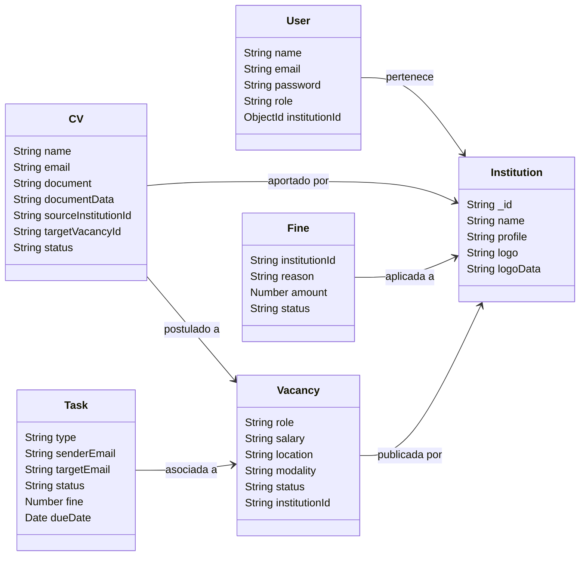

# Arquitectura del Sistema: Sistema de Intercambio-AMIB

Este documento proporciona una visión general y técnica de la arquitectura de software, bases de datos e infraestructura de despliegue del proyecto.

---

## 1. Estructura de Repositorio (Monorepo)

El proyecto está organizado como un repositorio unificado (monorepo) que divide la lógica del cliente y del servidor:

```
talent-collab/
├── backend/             # Servidor Express.js (Node.js)
├── frontend/            # Cliente SPA (React, Vite, Tailwind CSS)
├── dist/                # Bundle estático compilado del frontend (despliegue Hostinger)
├── scratch/             # Scripts utilitarios y de pruebas locales
├── package.json         # Configuración del monorepo y script de compilación raíz
└── replace-urls.js      # Utilidad para sustitución de URLs en compilación
```

---

## 2. Frontend (Arquitectura del Cliente)

Construido como una aplicación de una sola página (SPA) moderna, fluida y con un sistema de diseño responsivo.

* **Framework Principal**: React 19.
* **Empaquetador y Servidor Dev**: Vite 8.
* **Estilos**: Tailwind CSS 4 (con diseño glassmorphism y soporte nativo para Modo Oscuro mediante la clase `dark`).
* **Iconografía**: Lucide React.
* **Efectos Visuales**: Canvas Confetti (utilizado en la retroalimentación de tareas y postulaciones).
* **Control de Rutas**: React Router DOM 7.
* **Sistema de Autenticación**: Contexto global de React (`AuthContext` en `App.jsx`) que persiste la sesión del usuario (`localStorage`), maneja el inicio/cierre de sesión, actualización de perfiles (como logos) y el cambio de tema de colores.

### Módulos Principales (Páginas)
1. **Dashboard (`Dashboard.jsx`)**: Vista de analíticas que consume la API de métricas del servidor para mostrar 5 indicadores principales (Vacantes, Instituciones, CVs totales, CVs en proceso y Candidatos aceptados), así como desglose de solicitudes SLA y deudas de CVs por institución.
2. **Vacantes (`Vacantes.jsx`)**: Permite la publicación, edición y visualización de vacantes de empleo. Encripta la postulación directa de candidatos y la solicitud inter-institucional de perfiles (SLA), bloqueando operaciones en vacantes pausadas o cerradas.
3. **Mis Tareas (`Tareas.jsx`)**: Bandeja específica para los usuarios de universidades donde visualizan solicitudes recibidas de empresas y cargan CVs para completarlas.
4. **Gestión de Tareas (`GestionTareas.jsx`)**: Bandeja para administradores y coordinadores de empresas; gestiona la asignación de solicitudes, validación de currículums y multas por vencimiento de plazos.
5. **Directorio (`Directorio.jsx`)**: Lista de contactos institucionales ordenada alfabéticamente.
6. **Eventos (`Eventos.jsx`)**: Línea de tiempo de eventos y calendario de comités de vinculación con carga dinámica de carteles.
7. **Repositorio de Candidatos (`CVs.jsx`)**: Buscador general de talento compartido por las instituciones.

---

## 3. Backend (Arquitectura del Servidor)

El servidor actúa como una API REST monolítica robusta y ligera.

* **Entorno de Ejecución**: Node.js.
* **Framework Web**: Express.js.
* **Carga de Archivos**: Multer (almacena documentos PDF/Word de los candidatos y logos de las empresas en el directorio `uploads/`).
* **Servicio de Correo**: Brevo API (SMTP) integrado mediante un módulo helper (`sendEmail`) para notificar automáticamente acciones críticas del flujo de colaboración (nueva vacante, solicitud de CV, carga de talento o multas).
* **Seguridad y Control de Acceso**:
  * **Headers Personalizados**: El cliente inyecta las cabeceras `'X-Requester-Institution-Id'` y `'X-Requester-Role'` para la autenticación y validación de propiedad en las operaciones de escritura (edición, eliminación, cambio de estatus de vacantes).
  * **Seguridad de Datos**: Se almacenan copias redundantes en Base64 (`documentData`) de los archivos cargados directamente en la base de datos para prevenir pérdidas por borrados accidentales en el disco local de la instancia.

---

## 4. Base de Datos (Modelos Mongoose)

Se utiliza MongoDB como base de datos NoSQL con los siguientes esquemas definidos en Mongoose:



1. **`User`**: Cuentas de acceso (`role` enum: `'universidad'`, `'management'`, `'admin'`).
2. **`Institution`**: Ficha de la universidad o empresa (identificada por un string personalizado como `AMIB295`, `BBVA966`, etc.).
3. **`Vacancy`**: Ofertas laborales publicadas (`status` enum: `'Abierta'`, `'Pausada'`, `'Cerrada'`).
4. **`CV`**: Base de currículums de candidatos (`status` enum: `'Cartera'`, `'En Proceso'`, `'Aceptado'`, `'Rechazado'`).
5. **`Task`**: Tareas de colaboración y control de plazos (SLA). Al vencerse la fecha límite, se calculan multas en base al retraso.
6. **`Fine`**: Registro de multas financieras aplicadas a empresas por incumplimiento de plazos.
7. **`Notification`**: Historial de alertas de la campana y correos enviados.
8. **`Event`**: Eventos y convocatorias de comités institucionales.

---

## 5. Estrategia de Despliegue e Infraestructura

El despliegue está desacoplado para aprovechar las mejores ventajas de las plataformas en la nube:

### A. Frontend (Desplegado en Hostinger)
* **Proceso**:
  1. Cuando se actualiza la rama `main` en GitHub (`https://github.com/alba-programacion/talent-collab.git`), Hostinger jala el código automáticamente.
  2. Hostinger Node/Vite hosting ejecuta el script de compilación del `package.json` de la raíz:
     `npm run build --prefix frontend && npx shx cp -r frontend/dist ./dist`
  3. Esto compila el código frontend y copia la carpeta `/dist` a la raíz del servidor para ser servida como contenido web estático optimizado.

### B. Backend (Desplegado en Render)
* **Proceso**:
  1. Render requiere que el código de Node.js esté ubicado en la raíz del repositorio de despliegue.
  2. Para lograr esto, se mantiene un repositorio separado para el servidor: `https://github.com/alba-programacion/intercambio-back.git`.
  3. Los cambios del backend se separan del monorepo mediante el comando `git subtree split`:
     `git subtree split --prefix=backend -b temp-backend-split`
  4. La rama aislada `temp-backend-split` se empuja con fuerza (`force push`) al repositorio de Render:
     `git push backend-render temp-backend-split:main --force`
  5. Al recibir la actualización, la instancia de Render reconstruye y reinicia el servicio del backend automáticamente.

### C. Base de Datos
* Servida mediante un clúster administrado en la nube en **MongoDB Atlas**, al cual se conecta la API del backend mediante un URI seguro parametrizado por variables de entorno.
